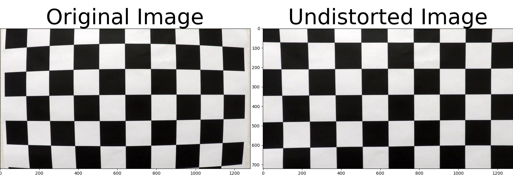
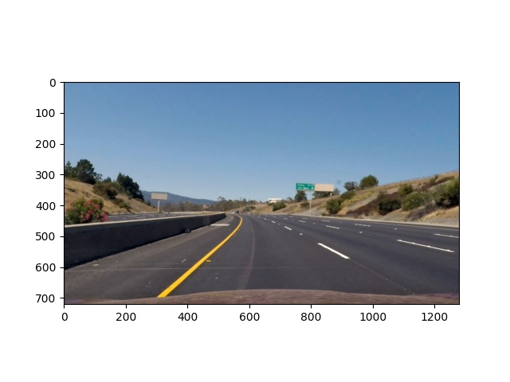
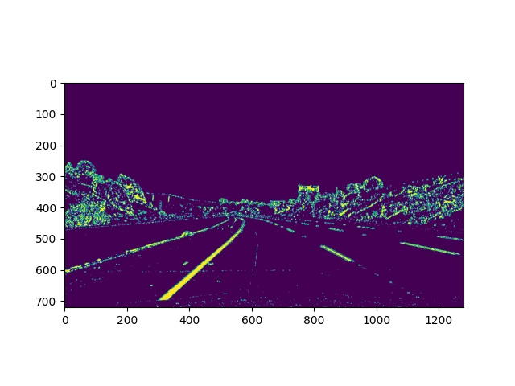
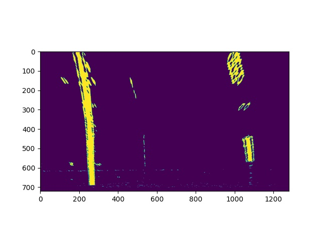
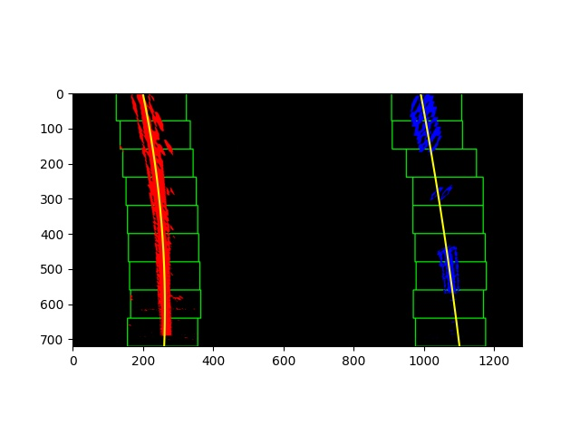
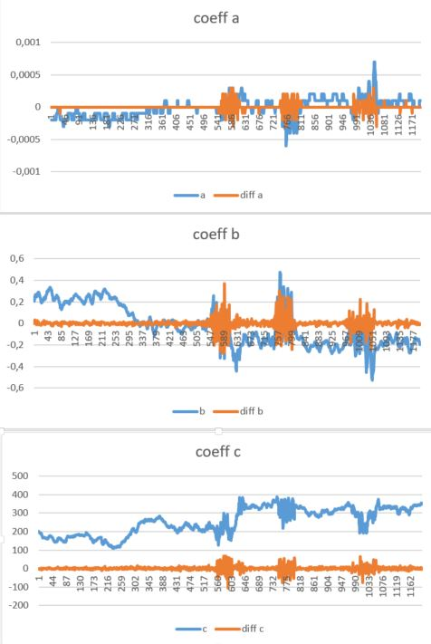

# Advanced Lane Finding

In this project, the goal is to write a software pipeline to identify the lane boundaries in a video.

## Pipline
The steps of the implemented pipeline are:
### Camera Calibration
In this step i compute the camera calibration matrix and distortion coefficients given a set of chessboard images,l using the dedicated function `Cam_Calib( )` whichs output `mtx` and `dist`. To do so i terate over all images in `camera_cal` folder and searhc for boarders using `cv2.findChessboardCorners(gray, (9,6),None)`. Once valid boarders are found, their corrdinates are appended to the list of `imgpoints` describing the 2d points in image plan. In the last step the transformation parameters are calculated using `cv2.calibrateCamera(objpoints, imgpoints, gray.shape[::-1], None, None)`.
Applied to the test image `calibration1.jpg` using the `cv2.undistort()` function this result is obtained: 

### Distortion correction, thresholding and warping

To maintain the code compact the 3 steps of undistoring, thresholding and warping are integrated in one function `undist_grad_warp()`. Thresholding binary image is done  with help of the function `grad_thresh` in `lib_functions.py`, whereas undistorting and warping are performed using the cv2 functions `cv2.undistort()` and `cv2.warpPerspective()`.

The results of these 3 steps are shown below (using first image from the video):
#### Distortion correction

#### Thresholding

#### Warping

### Finding the lines
After the pre-processing steps described above. the left and right lines are searched using `fit_polynomial(warped_img)`. This method uses the Windo search and returns `left_fit, right_fit, left_fitx,right_fitx, ploty` needed for plotting the detected lane into the video image. The result applied to the first image of the video is shown below:

### Calculating Curvature and Offset

Once valid lines are found, the x-fitted values of the right and left lines are used to calculate the curvature (using `measure_curvature_real( )`) and the offset to the center (`line#144 to line#154` in `AdnacedLane.py`).
These values are then added to the final image which is in turn written into the output video.

## Keeping track of left and right lanes 

To keep track of left and right lanes and store relevant attributes two instances of the class `Line()`are created and used. The main attributes of this calls are:
* detected: boolean variable to mark whether lane has been found or not  
* recent_xfitted = x values of the last valid n fits of the line
* current_xfitted = x values of the current n fits of the line
* bestx = average x values of the fitted line over the last n iterations 
* best_fit = polynomial coefficients averaged over the last n iterations  
* self.current_fit = values of the last n polynomian fits of the line

## How to filter out outlier and bad lanes

In order to achieve a smooth detection of the lanes, sanity check of the current detected line is used. Therefore the function `sanity_check` performs following checks:
* is the lane widht plasubile (in range [3m...4,7m])
* is the std of the lane widh plausible (< 0.5m), indicating parallel lines

Only in case both conditions are met, the sanity checks return `true` and the found line is used. Otherwise the last valid line is used.

## Final result
The detected lane is plotted into the image video using the function `plot_final`which takes `warped_orig,left_fitx,right_fitx,ploty,undist`as input. Finally  estimated curvature and offset to center are overlayed to this final result.
An example of the final result is shown below:

Here's a [link to my video result](./project_video_out.mp4)

## Discussion

The method ` search_around_ploy`was initially used, but showed lower quality results compared to the `window_search` method. Also evaraging the lines over time showed an decrease in the quality, since the estimated lane seemed to be too `inert`. To Debug this i exported the polynom coeafficients at each timestamp and tried to find the correlation between the bad lanes and these coefficients. The plots of left coeafficents are shown below:
. 

Although the plot show some correlation cross the coefficents (a,b and c) it was hard to define the threshold for accepting/rejecting the lines based on the coefficents. At the end the sanity_check and window_search method did a good job!